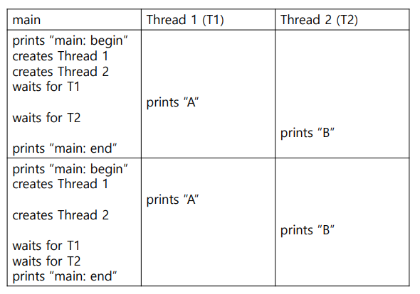
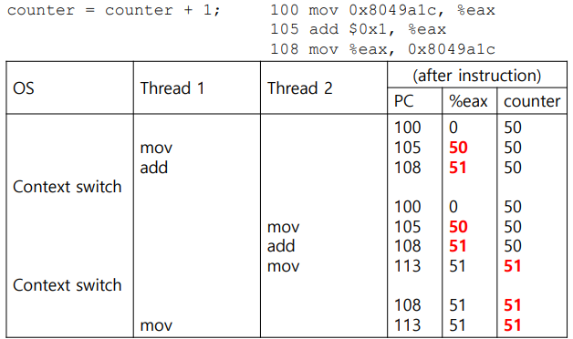

# Threads
- Multi-threaded 프로그램
    - 스레드 하나의 상태는 프로세스의 상태와 매우 비슷하다.
        - 각 스레드는 그것의 PC(Program Counter)와 private한 레지스터를 가지고 있다.
        - 스레드 당 하나의 스택을 가지고 있다.
    - 같은 address space를 공유하므로 같은 데이터를 접근할 수 있다.
    - Context Switch
        - Thread Control Block (TCB)
        - 같은 address space에 남아있다. (switch를 하는데 page table이 필요하지 않음)


- 사용하는 이유
    - 병렬성
        - Multiple CPUs
    - Blocking 회피
        - 느린 I/O
        - 프로그램에서 하나의 스레드가 기다리는 동안(I/O 작업을 위해 blocked 되어), CPU 스케줄러가 다른 스레드를 실행시킬 수 있다.
    - 많은 현대 서버 기반 어플리케이션은 멀티스레드를 사용하도록 구현되어 있다.
        - 웹 서버, 데이터베이스 관리 시스템, ...

## Thread 생성
```c
void *mythread(void *arg)
{
    printf("%s\n", (char *) arg);
    return NULL;
}
int main(int argc, char *argv[])
{
    pthread_t p1, p2;
    int rc;
    printf("main: begin\n");
    rc = pthread_create(&p1, NULL, mythread, "A"); assert(rc == 0);
    rc = pthread_create(&p2, NULL, mythread, "B"); assert(rc == 0);
    // join waits for the threads to finish
    rc = pthread_join(p1, NULL); assert(rc == 0);
    rc = pthread_join(p2, NULL); assert(rc == 0);
    printf("main: end\n");
    return 0;
}
```
- 실행 가능한 순서



- 공유 데이터

```c
static volatile int counter = 0;
void * mythread(void *arg)
{
    int i;
    printf("%s: begin\n", (char *) arg);
    for (i = 0; i < 1e7; i++) {
        counter = counter + 1;
    }
    printf("%s: done\n", (char *) arg);
    return NULL;
}
int main(int argc, char *argv[])
{
    pthread_t p1, p2;
    printf("main: begin (counter = %d)\n", counter);
    pthread_create(&p1, NULL, mythread, “A”);
    pthread_create(&p2, NULL, mythread, "B");
    pthread_join(p1, NULL);
    pthread_join(p2, NULL);
    printf("main: done with both (counter = %d)\n", counter);
    return 0;
} 
```
- 실행 결과
    - counter 값이 2e7이 아닌 다른 값이 나올 수 있다.
```bash
main: done with both (counter = 20000000)
main: done with both (counter = 19345221)
main: done with both (counter = 19221041) 
```
## Race Condition



## Critical Section
- Critical Section
    - 공유된 자원에 접근하는 코드 영역 (공유 변수)
    - 둘 이상의 스레드에 의해 동시에 실행되어서는 안 된다.
- Mutual Exclusion
    - 한 스레드가 critical section에 들어가면 다른 스레드는 들어갈 수 없다.

## Atomicity
- Atomic
    - 한 번에 실행되어야 하는 연산
        - 하나의 명령이 시작되었다면 해당 명령이 종료될 때까지 다른 명령이 시작되어서는 안 된다.
- synchronizaion을 어떻게 보장하는지
    - 하드웨어 지원 (atomic instructions)
        - Atomic memory add -> 있음
        - Atomic update of B-tree -> 없음
    - OS는 이러한 명령어들에 따라 일반적인 동기화 primitive 집합을 구현한다.
    
## Mutex
위의 Atomicity를 보장하기 위해 Mutex를 사용한다.
- Initialization
    - Static: `pthread_mutex_t lock = PTHREAD_MUTEX_INITIALIZER;`
    - Dynamic: `pthread_mutex_init(&lock, NULL);`
- Destory
    - `pthread_mutex_destroy();`
- Condition Variables
    - `int pthread_cond_wait(pthread_cond_t *cond, pthread_mutex_t *mutex);`
        - 조건이 참이 될 때까지 대기하는 함수
        - `pthread_mutex_lock`으로 전달할 mutex을 잠근 후에 호출되어야 한다.
    - `int pthread_cond_signal(pthread_cond_t *cond);`
        - 대기 중인 스레드에게 signal을 보내는 함수
        - `pthread_cond_wait`로 대기 중인 스레드 중 하나를 깨운다. 
    - 외부를 lock과 unlock으로 감싸줘야 한다.
- 두 스레드를 동기화
```c
while (read == 0) 
    ; // spin
```
```c
ready = 1;
```
- 오랜 시간 spin하게 되어 CPU 자원을 낭비하게 된다.
- 오류가 발생하기 쉽다.
    - 현대 하드웨어의 메모리 consistency 모델 취약성
    - 컴파일러 최적화

```c
pthread_mutex_t lock = PTHREAD_MUTEX_INITIALIZER;
pthread_cond_t cond = PTHREAD_COND_INITIALIZER;
pthread_mutex_lock(&lock);
while (ready == 0)
    pthread_cond_wait(&cond, &lock);
pthread_mutex_unlock(&lock);
```
```c
pthread_mutex_lock(&lock);
ready = 1;
pthread_cond_signal(&cond);
pthread_mutex_unlock(&lock);
```
- `#include <pthread.h>` 컴파일 시 `gcc -o main main.c -Wall -pthread` 와 같이 진행